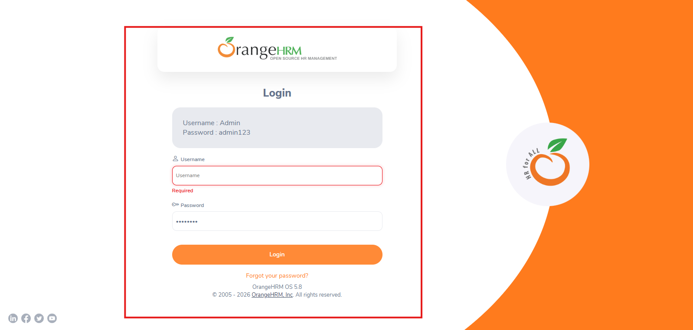
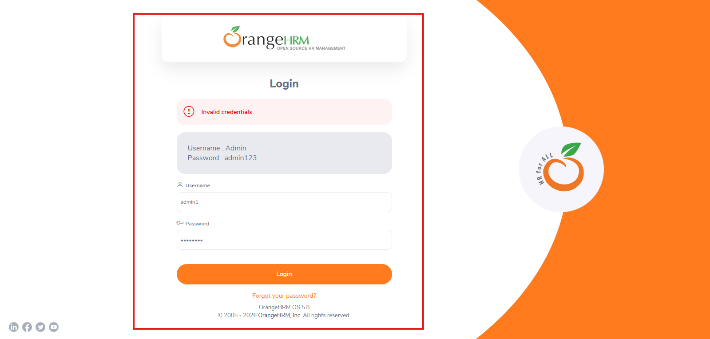

# 🐞 Bug Report

## Título
Login exibe mensagens de erro inconsistentes para credencias inválidas

## Tipo
UX

## Ambiente
- Sistema: OrangeHRM (Open Source Demo)
- URL: https://opensource-demo.orangehrmlive.com
- Ambiente: Produção (Demo pública)
- Navegador: Chrome
- Sistema Operacional: Windowns

## Pré-condição
- Usuário está na tela de login
- Página carregada corretamente

## Passos para reprodução
1. Deixar o campo usuário vazio e preencher a senha
2. Clicar em "login"
3. Repetir o teste preenchendo usuário inválido e senha inválida

## Resultado esperado
O sistema deve apresentar mensagens de erro consistentes e padronizadas para tentativas de login inválidas, garantindo clareza, previsibilidade e melhor experiência ao usuário

## Resultado real
O sistema exibe mensagens diferentes dependendo da combinação de credenciais inválidas, gerando inconsistência na comunicação do erro

## Severidade
Baixa

## Evidência

