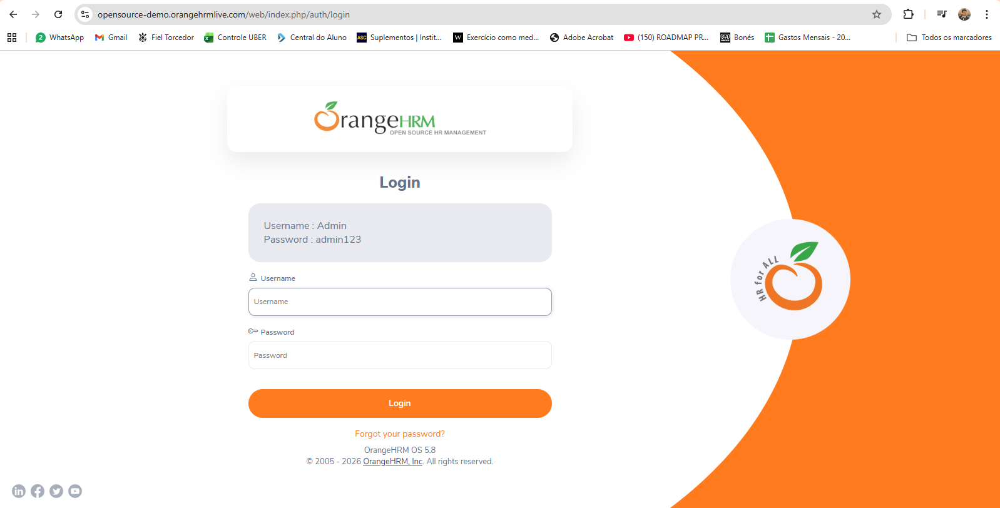
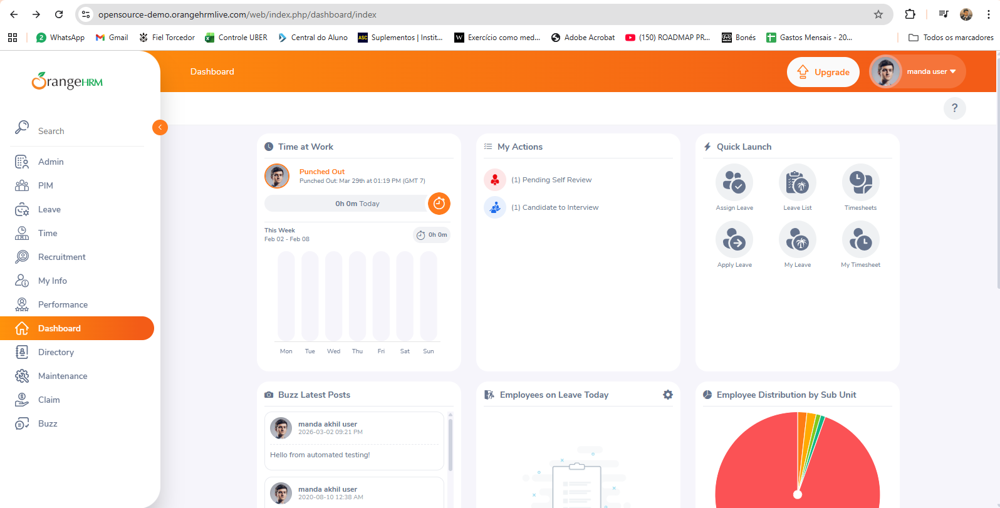

🐞 Bug Report

Título
Logout permite retorno visual ao Dashboard ao utilizar o botão Voltar do navegador

Tipo
Segurança

Ambiente: Sistema
OrangeHRM (Open Source Demo)

URL
https://opensource-demo.orangehrmlive.com

Ambiente
Produção (Demo pública)

Navegador
Chrome

Sistema Operacional
Windows

Pré-condição 
Usuário autenticado no sistema
Sessão ativa
Dashboard carregado corretamente

Passos para reprodução
Realizar login com usuário válido.
Acessar o Dashboard.
Clicar em Logout.
Na tela de login, clicar no botão Voltar (←) do navegador.

Resultado esperado
Após o logout, o sistema não deve permitir a visualização de páginas internas, mesmo ao utilizar o botão Voltar do navegador.
O usuário deve permanecer na tela de login e qualquer tentativa de acesso à URL interna deve ser bloqueada imediatamente.

Resultado obtido
Ao clicar no botão Voltar após o logout:
O Dashboard é exibido novamente.
A URL da área interna é carregada.
Ao tentar interagir com qualquer funcionalidade, o sistema redireciona o usuário para a tela de login.

Severidade
Baixa

### Evidências

- 

- 
